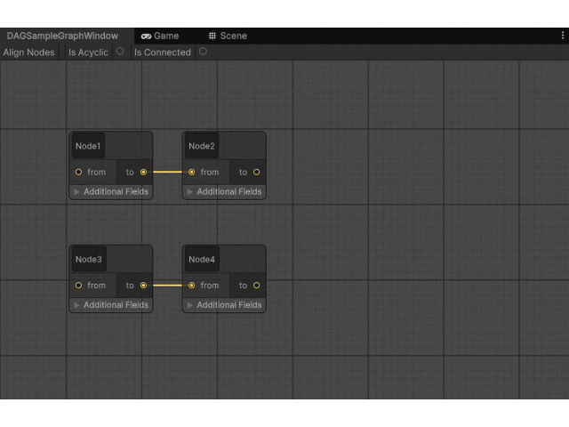
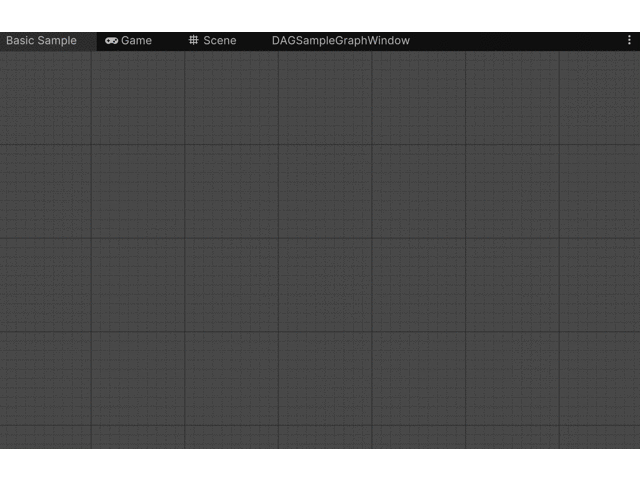
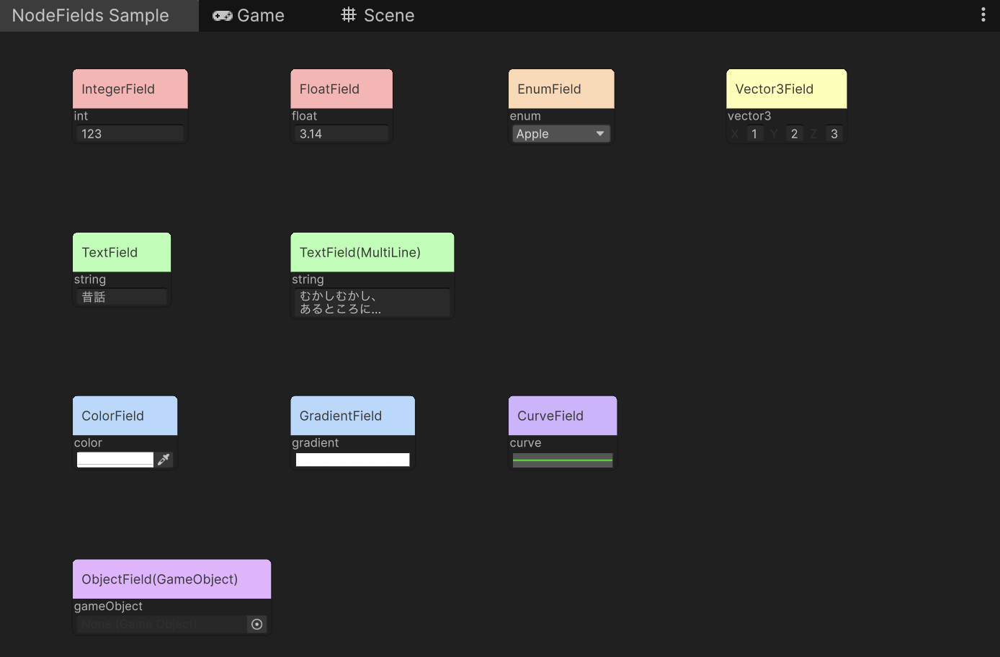
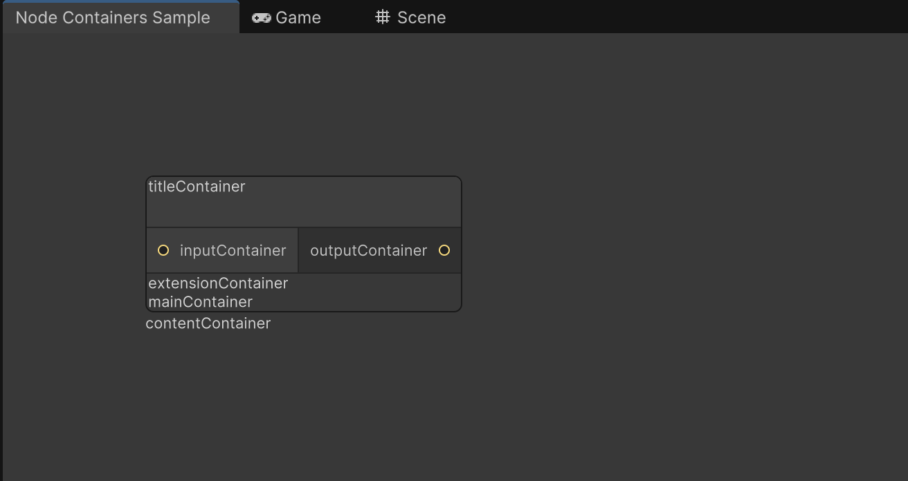
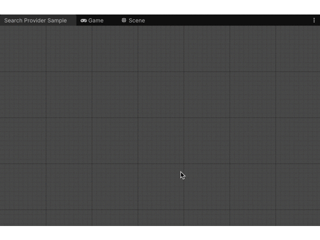
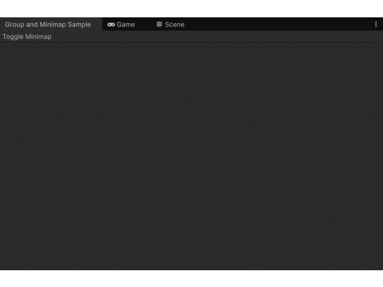
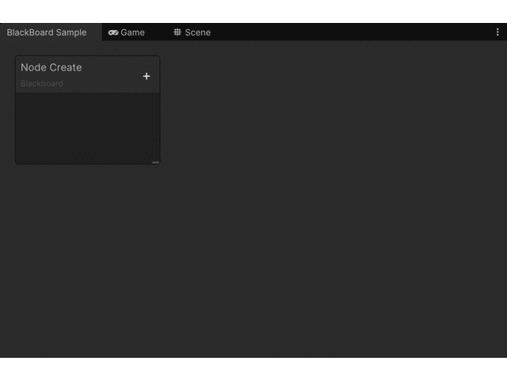

# unity-graph-view-samples

UnityEditor.Experimental.GraphView APIのサンプルリポジトリです。
グラフ構造を表すScriptableObjectのビューアーサンプルと、ミニサンプル集からなります。

GraphViewはExperimentalなAPIのため情報が少なく、体系的なサンプルがあると理解が捗ると思い作成しました。導入時のAPI理解にお役立てください。

## DAGSample

    

有向非循環グラフ(DAG)構造を表示するサンプルです。

以下のような機能を盛り込んであります。

- グラフ構造を表すScriptableObjectをロードしてViewを表示
- 基本的なNode・Edgeの作成・更新・削除機能
- ViewとScriptableObject間でのデータ同期
- 操作のUndo/Redo対応
- NodeのCopy&Paste
- ツールバー上でのグラフ構造の検査などのバリデーション

`Assets/GraphViewSamples/ScriptableObjects/DAGSample` 以下にサンプルデータのScriptableObjectを配置しています。
こちらのScriptableObjectのインスペクタから、GraphViewを開くことができます。

## MiniSample

GraphViewの各機能に関する、小さなサンプル集です。
`Window > Mini GraphView Samples` 以下のメニューから、各サンプルのGraphViewを開くことができます。

### BasicGraphView

基礎的なAPIを使ってGraphViewを表示して見るまでのサンプルになります。
(GraphViewの表示~Nodeの作成~Node間をEdgeで結ぶところまで)

    

### NodeFields

Nodeに設定することができる各種Fieldの表示サンプルになります。

    

### NodeContainers

Nodeが持つ各コンテナ(小要素の格納と表示を行う領域)を表示するだけのサンプルです。

    

### SearchProvider

GraphView上で、カスタムSearchWindowを表示するためのサンプルです。
(異なる型のNodeをGUI上から生成する時などにこの機能を使います)

    

### GroupAndMiniMap

Group機能(Nodeをグルーピングしてまとめる機能)とMiniMap表示機能までのサンプルです。

    

### BlackBoard

BlackBoard機能を表示するまでのサンプルです。
サンプルでは、BlackBoard上の変数をドラッグ&ドロップしてNodeを生成する例を実装してみています。
※BlackBoardは本来、Graph間で共有する変数を管理などをする機能です。本来のBlackBoardの機能とは逸れていることにご配慮ください。あくまでBlackBoardで表示できるものやD&D機能のサンプルになります。

    

